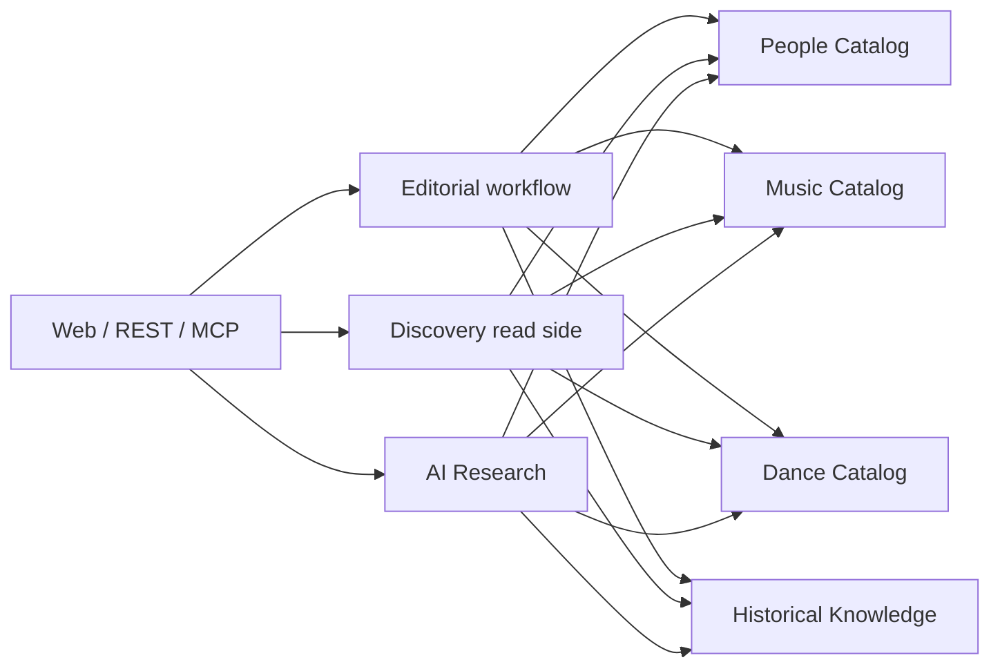

# Границы Editorial, Discovery и AI Research

Статус: `accepted`

Документ фиксирует устойчивые логические границы трёх supporting capabilities. Это не решение о микросервисах, отдельных БД, Python packages, классах или директориях. Физическая структура кода определяется при декомпозиции первой использующей story, но не должна нарушать описанное здесь владение.

## Классификация границ

| Capability | Тип границы | Чем владеет | Чем не владеет |
|---|---|---|---|
| `Editorial` | application workflow | редакционными действиями, review notes и аудитом переходов | содержанием объектов и их доменными инвариантами |
| `Discovery` | read side | производными read models и query-контрактами | исходными данными, публикацией и write-командами |
| `AI Research` | supporting subsystem | техническим корпусом поиска, AI-запусками, evaluation и proposals | опубликованными Claims, каталоговыми сущностями и редакционным решением |

Названия являются стабильными терминами архитектуры. Они не получают статус bounded context или отдельного deployment unit без нового решения.

## Editorial

### Назначение

Editorial даёт единый путь для действий `draft → in_review → published → archived`, проверки прав, замечаний и аудита. Он координирует процесс, но не становится универсальным владельцем любого контента.

### Ответственность

- проверить, имеет ли actor право выполнить редакционное действие;
- вызвать публичный application use case context-владельца;
- сохранить автора, время, действие и результат для аудита;
- хранить review notes, если они относятся к процессу проверки, а не к опубликованному материалу;
- формировать редакторскую очередь из статусов и замечаний разных contexts;
- обеспечить, что AI proposal может стать только draft и не публикуется автоматически.

### Владение состоянием

Содержимое и `editorial_status` объекта принадлежат context-владельцу. Например, статус Claim хранится вместе с Claim в Historical Knowledge, а статус Recording — с Recording в Music Catalog. Именно владелец проверяет свои инварианты публикации.

Editorial не обновляет чужие таблицы напрямую. Он оркестрирует вызов вроде `publish_claim`, после чего Historical Knowledge либо выполняет переход, либо возвращает доменную ошибку. Это исключает два конкурирующих источника статуса.

### Логические объекты

Это термины планирования, а не утверждённые таблицы:

| Объект | Назначение | MVP |
|---|---|---|
| `EditorialAction` | кто, когда и какой переход запросил; результат и причина отказа | нужен для значимых переходов |
| `ReviewNote` | внутреннее замечание к проверяемому объекту | нужен при появлении review-сценария |
| `EditorialQueueItem` | элемент `/studio` для незавершённой работы | производная read model, не источник истины |

Не вводить generic `EditorialItem`, содержащий копию любого доменного объекта. Точная политика публикации собственного материала остаётся вопросом отдельной story.

## Discovery

### Назначение

Discovery отвечает за чтение, которое объединяет данные нескольких contexts: стартовую страницу, списки, поиск, карту, связанные сущности и составные страницы.

### Ответственность

- отдавать стабильные query DTO для UI, REST и read-only MCP;
- собирать только доступные пользователю опубликованные данные;
- строить узлы и рёбра карты из каталоговых объектов и опубликованных Claims;
- поддерживать поиск, фильтры, пагинацию и связанные материалы;
- позволять заменить простой SQL на projection или индекс без изменения доменной записи.

### Логические read models

| Read model | Пример содержимого |
|---|---|
| `EntitySummary` | ID, тип, название, preview и статус видимости |
| `SearchResult` | summary, совпавшее поле и релевантный контекст |
| `MapNode` / `MapEdge` | отображаемый объект и объяснимая опубликованная связь |
| `RelatedEntity` | связанный объект, вид связи и краткое объяснение |
| `HomeStatistics` | количество опубликованных жанров, исполнителей, записей и танцев; не входит в HOME-0, появляется на HOME-1 |

Read models производны и должны быть перестраиваемыми. Discovery не принимает write-команды, не определяет истинность Claim и не меняет lifecycle объекта.

Discovery query является read use case и оркестрирует публичные application/query contracts владельцев данных. Для сложной страницы каждый context может предоставить предметный public reader, который пакетно загружает и проецирует только собственные данные. Discovery применяет межконтекстные правила видимости и собирает конечный DTO, но не импортирует чужие ORM-модели и не выполняет прямой SQL по нескольким contexts.

Context-владелец фильтрует собственные `published`, `deleted` и access rules. Чистый mapper/projector может отделять сборку DTO от I/O, но не является обязательным классом. Материализованные projections, cache, отдельная read database и Elasticsearch добавляются только по измеренной необходимости. Политика application operations и read contracts определена в [ADR-0008](../decisions/0008-application-operations-read-contracts-and-transactions.md).

## AI Research

### Назначение

AI Research изолирует ingestion, retrieval, RAG, agents и evaluation от опубликованной доменной истины. Ошибка извлечения, embedding или модели должна приводить к отклонённому proposal либо перестройке индекса, а не к незаметному изменению каталога или истории.

### Разделение владения данными

| Данные | Владелец | Причина |
|---|---|---|
| `Source`, `SourceVersion`, `SourceFragment` | Historical Knowledge | это provenance и материал для Evidence независимо от AI |
| `Claim`, `ClaimEvidence`, evidence status | Historical Knowledge | это публикуемое историческое знание |
| `IngestionJob` | AI Research | техническое выполнение импорта и извлечения |
| `RetrievalChunk`, `EmbeddingRecord`, `IndexEntry` | AI Research | производные данные, которые можно удалить и перестроить |
| `CorpusAdmission` | AI Research | решение включить конкретную версию/фрагмент в retrieval-корпус; содержит editor audit, но не меняет истинность Claim |
| `RetrievalRun`, `AgentRun` | AI Research | трассировка входов, использованных фрагментов, модели и результата |
| `EvaluationCase`, `EvaluationRun` | AI Research | воспроизводимая проверка groundedness, citations и отказов |
| `AIProposal` | AI Research до передачи | кандидат, не являющийся Claim или каталоговой сущностью |

`RetrievalChunk` может технически нарезать один `SourceFragment` иначе для конкретной embedding-модели. Он всегда ссылается на исходный fragment и не заменяет его.

### Разрешённый workflow

```text
Historical Knowledge Source/Fragment
  → ingestion and index in AI Research
  → retrieval / agent run
  → AIProposal
  → application use case владельца
  → draft
  → Editorial review
  → published by context owner
```

AI Research:

- не пишет напрямую в таблицы People, Music, Dance или Historical Knowledge;
- не публикует материал и не присваивает `supported` без Evidence;
- передаёт proposals через обычные application-команды с теми же validation и authorization;
- хранит достаточно provenance для воспроизведения ответа и редакторского аудита;
- может безопасно перестраивать технический индекс без изменения Source и Claim.

MCP является transport boundary, а не частью AI Research целиком. Read-only tools поиска и чтения вызывают Discovery или application queries; `ask_published_corpus` использует AI Research; будущие write-tools создают draft через соответствующий application use case.

## Направление зависимостей



Каталоги и Historical Knowledge не зависят от UI, Discovery или AI Research. Они могут предоставлять application/query contracts и предметные public readers, но не знают, какой transport или workflow их вызвал. Reader возвращает application-owned read DTO и скрывает локальный persistence plan; универсальный фасад всех данных контекста не вводится.

## Почему без event bus

Логическая развязка не требует брокера сообщений. Сейчас её обеспечивают:

- односторонние зависимости;
- публичные application/query contracts;
- запрет прямой записи в чужие данные;
- производность и перестраиваемость Discovery и AI indexes;
- единая транзакция либо явный синхронный orchestration там, где нужна согласованность.

Инфраструктурный event bus сейчас не добавляется: нет независимых deployment units, фоновых подписчиков с собственным lifecycle или требования переживать временную недоступность получателя. Очередь, retries, ordering, idempotency, outbox и monitoring были бы дополнительной системой без продуктовой необходимости.

Переход позднее остаётся прямым: сначала выделить стабильный application contract. Job worker при необходимости получает task delivery; outbox и event bus добавляются только при появлении независимого подписчика на доменное событие с требованием надёжной доставки.

## Триггеры пересмотра

| Граница | Когда вернуться к решению |
|---|---|
| Editorial как отдельный bounded context | появились назначения reviewer, SLA, версии review, независимый workflow и собственный устойчивый язык |
| Discovery как отдельный service | измерены независимое масштабирование чтения, специализированный индекс или отдельный release lifecycle |
| AI Research как отдельный process/service | ingestion или agents должны выполняться независимо, долго, с retries и изоляцией отказов |
| Event bus | появился хотя бы один реальный независимый consumer доменных событий и требование надёжной асинхронной доставки |

## Принятое решение

1. Принять три логические границы и направление зависимостей без утверждения физической структуры кода.
2. Принять разделение: Historical Knowledge владеет Source и Evidence, AI Research — производными индексами, runs и proposals.
3. Не вводить event bus, очередь и outbox до появления конкретного независимого асинхронного потока.

Решение принято пользователем 2026-08-15.

Обработка binary media не добавляется к этим трём capability. Для неё отдельно принята граница [Media Management](media-management.md), поскольку хранение bytes, генерация вариантов и streaming integrations являются самостоятельным кандидатом на отдельный процесс, но не новым bounded context MVP.
