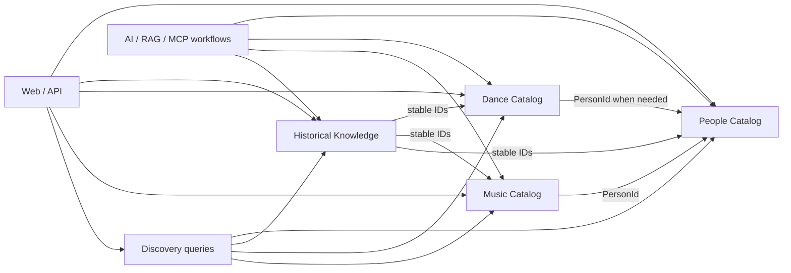

# DDD Workshop 003: Context Map и владельцы правил

Статус: `accepted`

Цель: определить минимальные bounded contexts и направление зависимостей внутри одного модульного монолита. Контекст здесь означает границу языка и владения правилами, а не отдельный сервис, базу данных или deployment unit.

Этот workshop не определяет агрегаты, таблицы, HTTP endpoints или структуру директорий. Они рассматриваются после принятия Context Map.

## DQ-01. Сколько bounded contexts нужно в MVP?

### Проблема

Предварительный обзор называл Knowledge Catalog, Historical Narrative, Dance Knowledge, Editorial, Discovery и AI Research отдельными contexts. Для старта это создаёт риск принять техническую функцию или read model за самостоятельную предметную область.

### Вариант A: три context

```text
Music Catalog
Dance Catalog
Historical Knowledge
```

| Bounded context | Чем владеет | Чем не владеет |
|---|---|---|
| `Music Catalog` | Genre, Style, ClassificationConcept, Performer, Group, MusicalWork, Recording, Release, credits, memberships и базовые metadata | Историческими интерпретациями, Story и Dance |
| `Dance Catalog` | идентичностью Dance, названиями, aliases, терминами и базовыми описательными metadata | Историческими Claims, музыкальными сущностями и оценкой танцевальности Recording |
| `Historical Knowledge` | Claim, Evidence, Source, Story и содержательными отношениями между объектами, включая Genre relations и DanceGenreRelation | Идентичностью Performer, Genre, Dance или Recording |

Все три являются модулями одного приложения и на старте используют одну реляционную БД. Отдельные сервисы, схемы БД, брокер сообщений и распределённые транзакции не требуются.

В этом варианте Music Catalog владеет Performer как музыкальной идентичностью человека. Если позднее тот же человек становится Dancer или Choreographer в Dance Catalog, потребуется выделение общей Person identity и миграция ссылок.

### Принятое решение: добавить People Catalog

```text
People Catalog
Music Catalog
Dance Catalog
Historical Knowledge
```

`People Catalog` владеет только общей идентичностью физического человека:

- `PersonId`;
- canonical name и aliases;
- базовыми датами жизни с provenance;
- внешними идентификаторами;
- identity merge/split при дублях.

Он не владеет музыкальными или танцевальными ролями:

| Понятие | Владелец |
|---|---|
| Louis Armstrong как человек | People Catalog |
| Его RecordingCredit, instrument и GroupMembership | Music Catalog |
| Claim о его историческом влиянии | Historical Knowledge |
| Frankie Manning как человек | People Catalog |
| Его будущая роль Dancer/Choreographer | Dance Catalog |

В этом варианте `Performer` — музыкальная роль или представление Person, а не вторая независимая личность. RecordingCredit и GroupMembership ссылаются на PersonId; Music Catalog владеет смыслом музыкального участия. Group остаётся в Music Catalog и не считается Person.

Преимущество: одна личность может участвовать в музыке и танце без дублирования. Цена: дополнительная граница и межконтекстная ссылка уже на каждой странице Performer.

### Основание решения

People Catalog оправдан, поскольку общая личность музыканта, танцора и хореографа должна сохранять один ID при развитии Dance domain. Это реальная будущая граница, а не универсальный каталог «всего». Принятый Context Map состоит из четырёх contexts.

Не создавать generic `Party`, `Actor`, `Participant` или единый каталог Person/Group/Organization: такие абстракции пока не имеют требований.

### Почему Dance отделён

Сегодня Dance Catalog мал, но его язык уже отличается: Dance, его практики и будущие танцоры/школы/события. Исторические Claims и HistoricalRole принадлежат Historical Knowledge, а не Dance Catalog. Отделение сохраняет будущую доменную границу без выделения сервиса или сложной инфраструктуры.

Принято: Performer является музыкальной ролью Person, Group остаётся отдельной сущностью Music Catalog, Dance Catalog сохраняет отдельную доменную границу. Решение принято пользователем 2026-08-15.

## DQ-02. Кому принадлежат связи и Claims?

### Принятое решение

Music Catalog и Dance Catalog владеют идентичностью и фактическими metadata. Historical Knowledge владеет утверждениями о значении, влиянии и исторических отношениях.

Примеры:

| Изменение | Владелец |
|---|---|
| Изменить canonical name Person или добавить alias | People Catalog |
| Сохранить `credited_as` в конкретной Recording | Music Catalog |
| Добавить RecordingCredit | Music Catalog |
| Утверждать, что Person в роли Performer повлиял на другого | Historical Knowledge |
| Утверждать, что Genre developed_from другого Genre | Historical Knowledge |
| Изменить имя, alias или базовое определение Dance | Dance Catalog |
| Добавить утверждение об истории или происхождении Dance | Historical Knowledge |
| Связать Dance с Genre через HistoricalRole | Historical Knowledge |
| Собрать Comparison или Journey | Historical Knowledge |

Claim хранит ссылки на стабильные идентификаторы объектов других contexts, но не становится владельцем их названий и metadata. Удаление объекта Catalog не должно оставлять опубликованный Claim с неразрешимой ссылкой; точная delete/archive policy определяется позже.

Все содержательные исторические связи и утверждения принадлежат Historical Knowledge. DanceGenreRelation является специализированным Claim Historical Knowledge, а не сущностью Dance Catalog. Решение принято пользователем 2026-08-15.

## DQ-03. Являются ли Editorial, Discovery и AI отдельными contexts или модулями?

### Принятое решение MVP

Это не bounded contexts и не сервисы, но для них фиксируются устойчивые логические границы:

- `Editorial` — workflow публикации объектов четырёх contexts и набор authorization/audit requirements.
- `Discovery` — query/read-model слой для карты, поиска, списков и связанных материалов; не владеет исходными данными.
- `AI Research` — application workflow и adapters для ingestion, RAG, MCP и agent proposals; создаёт draft через обычные use cases.

Это не запрещает позднее выделение context, module или service. Основанием станут реальные независимые правила, жизненный цикл и несколько потребителей. Физические package boundaries определяются application architecture и первой использующей story:

| Capability | Зачем нужна | Что пока не решено |
|---|---|---|
| `Editorial` | Оркестрировать draft/review/publish, права и аудит, оставляя статус у context-владельца | package boundaries и точная persistence-модель аудита |
| `Discovery` | Собирать страницу, карту или поиск из нескольких contexts без переноса владения данными | query service, projections и способ оптимизации SQL |
| `AI Research` | Не позволять ingestion, RAG, MCP и agents обходить доменную запись и публикацию | adapters, orchestration и границы packages |

Если capability не нужна первой story, пустая директория, интерфейс или module «на будущее» не создаются. Полное предложение по владельцам данных, разрешённым зависимостям и триггерам выделения описано в [границах supporting capabilities](../supporting-capabilities.md).

### Примеры

- Карта читает опубликованные Genre и Claims, но не редактирует их — это Discovery query.
- Researcher agent предлагает новый Claim, но сохраняет его через Historical Knowledge use case — это AI workflow.
- Editor переводит Claim из draft в published по общей policy — это application workflow, пока отдельного редакционного агрегата нет.

Уточнённые логические границы приняты пользователем 2026-08-15.

## DQ-04. Как contexts взаимодействуют внутри монолита?

### Предлагаемое направление зависимостей

Диаграмма показывает принятые четыре contexts. Music Catalog и в будущем Dance Catalog используют PersonId через application contract People Catalog.



Стрелка означает разрешённое использование публичных application contracts, а не импорт ORM-моделей или прямую запись в чужие таблицы.

### Минимальные правила

1. Context изменяет только принадлежащие ему данные.
2. Межконтекстный use case оркестрируется application layer.
3. Прямой вызов application service внутри процесса допустим; event bus не нужен.
4. Одна БД допустима; отдельная schema на context не требуется.
5. Discovery может читать согласованные projections или выполнять оптимизированный query, но не становится источником истины.
6. Web, REST, MCP и agents не обходят use cases ради прямой записи.

### Что такое event bus

Event bus — инфраструктурный посредник для доставки событий от издателя подписчикам. Например, Historical Knowledge публикует `ClaimPublished`, а отдельные обработчики асинхронно обновляют search index, сбрасывают cache и отправляют notification. Его основная ценность — развязка компонентов, доставка и независимая асинхронная обработка, а не ускорение CPU-bound или IO-bound операции само по себе.

В MVP это добавило бы delivery semantics, retries, ordering, idempotency, outbox и мониторинг без реального отдельного процесса или нескольких независимых потребителей. Вместо этого application use case синхронно сохраняет изменения и, если требуется, обновляет простой read model в той же транзакции или прямым вызовом.

Запрет относится к инфраструктурному bus. Небольшой in-process domain event допустим позднее как способ организовать код, но только при реальном втором обработчике. Обычный job worker может использовать task queue и сам по себе не требует event bus. Event bus понадобится, когда появятся независимые подписчики на доменные события с собственными delivery/retry requirements.

Принято: одна БД, синхронные application-вызовы и отсутствие инфраструктурного event bus в MVP. Решение принято пользователем 2026-08-15.

## DQ-05. Что осознанно не проектируем сейчас?

`Список исключений` — это перечень осознанных non-decisions текущего этапа. Пункт не запрещён навсегда и не потерян: мы явно не выбираем его устройство сейчас, чтобы не зафиксировать архитектуру без требования. Для возврата указан проверяемый триггер.

| Сейчас исключено | Почему | Когда вернуть в обсуждение |
|---|---|---|
| Микросервисы и отдельные deployment units | Нет независимого масштабирования, команд или release cycles | Появилась измеренная операционная граница |
| Event-driven integration и инфраструктурный event bus | Нет независимых подписчиков на доменные события | Появился независимый event consumer с требованием надёжной асинхронной доставки |
| Универсальный generic Entity aggregate | Скрывает разные инварианты Genre, Person, Group, Recording и Dance | Только если появится реальный общий lifecycle, а не сходство полей |
| Отдельный MediaAsset bounded context | Пока это supporting capability без самостоятельного языка | Появились сложные rights workflow и несколько независимых потребителей |
| Search context или Elasticsearch | Для стартового объёма достаточно SQL/read queries | Измерены нерешаемые требования поиска или масштаба |
| Context для provider integrations | Provider является внешним adapter, а не владельцем домена | Появился самостоятельный lifecycle синхронизации нескольких providers |
| Aggregate и transaction boundaries | Это предмет следующего workshop, а не текущего Context Map | Сразу после принятия contexts |

Добавлять такую границу следует только при реальном владельце правил, конфликте языка, независимом жизненном цикле или измеренной технической необходимости.

Список принят пользователем 2026-08-15 как ограничения текущего этапа, а не вечные запреты.

## Текущий результат workshop

1. Четыре bounded contexts: People Catalog, Music Catalog, Dance Catalog, Historical Knowledge.
2. Все исторические Claims и связи принадлежат Historical Knowledge.
3. Editorial, Discovery и AI Research приняты как логические supporting capabilities с явным владением и зависимостями; физические code/module boundaries пока не проектируются.
4. Приложение является модульным монолитом с одной БД и синхронными вызовами без event bus.
5. Принят список архитектурных non-decisions и триггеров возврата.
6. Следующим DDD-этапом был Workshop 004 по aggregate boundaries и инвариантам; он проведён и принят 2026-08-15.

Все решения workshop приняты пользователем 2026-08-15.
